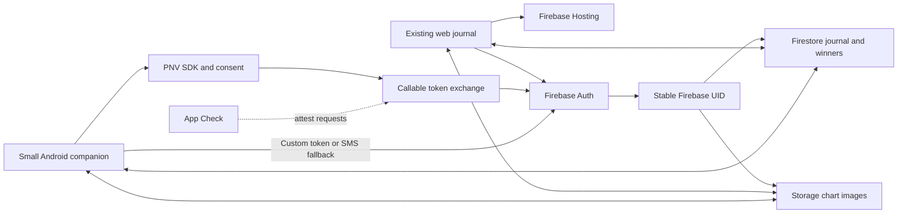

# TradeMaster: private journal access with optional live PNV

Prepared 2026-09-12 against commit `17c2d39a3b09d3dc7d6bc5793dc359498b406d91`; updated for the 2026-09-14 three-tab showcase. The web baseline is Calculator, Journal, and Winner Database with Google and standard SMS phone auth/linking. SIM-less PNV is excluded, normal PNV is conditional on live carrier feasibility, and MBI/Playbook/Sell Check/Dashboard/AI Coach are not current UI surfaces. Read [the repository assessment](REPOSITORY-UNDERSTANDING.md) for the current architecture and verification limits.

**Recommendation:** use the v9 three-tab web app with Google and linked SMS phone authentication as the dependable baseline. Add normal carrier-backed Firebase PNV through a small native Android companion only after confirming a supported device/carrier and production-enabled project. Analytics and Crashlytics are deliberately out of scope for this one-week learning project. SIM-less PNV is outside scope. See [the service assessment](FIREBASE-SERVICE-ASSESSMENT.md) for the evidence and add/remove decisions.

The pitch to Firebase leads: “A user opens the same private Calculator, Journal, and Winner Database through Google or verified-phone sign-in, captures chart evidence, and sees it sync across devices. Where carrier verification is supported, PNV removes SMS friction. We explain failures and enforce account isolation.”

## 1. Scope and service selection

Keep the calculator, importer, trade engine, and Winner model in their existing JavaScript modules. Android needs only four compact surfaces: access, recent journal entries, quick Winner capture, and account settings. It does not need to reproduce the three-tab web shell.

| Service | Existing or new | Concrete responsibility |
| --- | --- | --- |
| Firebase Phone Number Verification | Conditional; live carrier only | Android carrier-backed phone verification without SMS OTP |
| Firebase Authentication | Existing; extend | Stable identity across Google, linked phone SMS and PNV custom-token sign-in |
| Cloud Functions for Firebase | Current for screenshot cleanup; conditional for PNV | Delete obsolete Winner screenshot objects from Firestore lifecycle triggers; later validate PNV proof, link verified numbers and issue Firebase custom tokens if the Android branch proceeds |
| Cloud Firestore | Existing; retain | Same per-UID trades, winners and settings on both clients; server-owned verification status |
| Cloud Storage for Firebase | Existing; refine | Compressed chart screenshots associated with Winner records |
| Firebase App Check | New | Attestation for the exchange endpoint and protected database/storage access |
| Firebase Hosting | Configuration exists; use for demo | Serve the static web journal and any required public privacy page |
| Google Analytics for Firebase | Deferred | Out of scope for this one-week personal learning project |

Use the Local Emulator Suite for backend/rules tests. This is development tooling, not another product feature. Firebase Hosting fits static apps; App Hosting adds no needed capability here. [Hosting documentation](https://firebase.google.com/docs/hosting)

The core app needs Auth, Firestore, Storage, Hosting and App Check. Google and verified phone are the supported web sign-in methods. The current web baseline also uses Functions for trusted screenshot lifecycle cleanup. Retain the future PNV Functions branch for proof validation, account linking and custom-token issuance. Remote Config is the first optional extension for controlling PNV availability and fallback UI. Do not add Realtime Database, SQL Connect, notifications, live quotes, broker execution or an LLM to the first milestone. Journal statistics are ordinary closed-trade summaries; MBI fields are compatibility-only.

## 2. What “OTP bypass” means in this project

Use **Continue with your mobile number** for normal phone sign-in and **Verify without SMS** only where live PNV actually succeeds. Firebase Auth SMS OTP and carrier-backed Firebase PNV are separate paths. SMS fallback does not demonstrate OTP-free verification.

PNV's public integration is Android-specific. A desktop website or mobile web page cannot simply enable the Android PNV SDK. The backend validates its proof and exchanges it for a Firebase Auth custom token. [PNV overview](https://firebase.google.com/docs/phone-number-verification), [PNV sign-in integration](https://firebase.google.com/docs/phone-number-verification/android/sign-in)

**Live PNV gate:** before building the companion, confirm an Android device/SIM supported by the SDK at the intended demo location, a production-enabled Firebase project, Blaze billing, app fingerprints, API configuration, and OAuth brand/privacy-policy review. Current public carrier coverage does not list India. Do not assume an overseas SIM roaming in India will work; validate the actual configuration with the team and a real request. [Carrier coverage](https://firebase.google.com/docs/phone-number-verification/pricing), [production prerequisites](https://firebase.google.com/docs/phone-number-verification/android/production-mode)

The normal PNV design remains in this plan, but a live demo is not promised until that gate passes. There is no SIM-less implementation or demo milestone. If access is unavailable, deliver Google + linked SMS phone sign-in with shared journal data, App Check and rules. Backend unit tests and Auth emulator tests remain useful engineering checks; they do not stand in for carrier verification.

## 3. The demo journey

Use synthetic trades and chart images in a dedicated demo Firebase project.

1. Open the existing web app with a Google account that already owns a small sample journal.
2. In the Android companion, sign into that same Google account and explicitly connect its mobile number. Use PNV when supported and SMS when chosen as fallback. This setup preserves the existing UID.
3. If the live PNV gate passes, sign out on Android and show phone sign-in through the explainer, native consent UI, validated carrier proof and journal. Otherwise demonstrate linked SMS sign-in on the web and omit the Android/PNV segment.
4. Add a Winner entry with a chart screenshot on Android, or in a second authenticated web session for the web-only version. Watch it appear in the desktop Winner DB through the existing Firestore listener.
5. Show unsupported-device handling and the SMS fallback. Cancellation returns to method selection; it does not silently send a text message.
6. Show another user being denied access to the journal; include invalid PNV proof rejection if PNV is enabled. Show Auth, Firestore and Storage console evidence for the completed flow.

This connects access to a task that benefits from mobile: capturing chart evidence while away from the desktop. Phone verification is an additional access method, not an arbitrary requirement to use the calculator.

## 4. Proposed architecture with live PNV



The screenshot-cleanup Functions are part of the current web baseline: Firestore triggers react to Winner deletion and `imageStoragePath` changes, then delete only the obsolete owner-scoped Storage object. The PNV/Android branch remains conditional. A web-only release does not need an otherwise unused token-exchange backend, but it does need the cleanup function deployed if browser-side obsolete-image cleanup is not being used. When PNV proceeds, use second-generation callable Functions with the corresponding Firebase client SDKs. They carry Auth and App Check tokens when available, but the application must still validate the separate PNV token. A sign-in exchange necessarily accepts callers without an existing Firebase login; a linking endpoint requires a recently authenticated user. [Callable function behavior](https://firebase.google.com/docs/functions/callable)

### Endpoint responsibilities

| Proposed endpoint | Input and caller | Result |
| --- | --- | --- |
| `exchangePnvToken` | PNV token, request ID, valid App Check; no existing Auth session required | Verified phone resolved to a stable UID; Firebase custom token |
| `linkVerifiedPhone` | PNV token, request ID, App Check, recent Firebase Auth session | Associate verified number with the caller's UID; conflict if already owned elsewhere |

The backend validates the PNV JWT's type, allowed signing algorithm/signature via Google's JWKS, expected project issuer and audience, and expiry. Only the verified subject supplies the number. A decoded-but-unverified JWT, a client number string or a client `phoneVerified` flag is never sufficient. [PNV token verification](https://firebase.google.com/docs/phone-number-verification/verify-tokens)

Application-specific handling beyond the documentation sample:

- Resolve existing users through Admin Auth phone lookup. Create a user only for the specific user-not-found result; distinguish service outages and malformed input. Re-resolve races where a concurrent create wins.
- Reject disabled users. Never derive the target UID from a caller-controlled field.
- Bound request size and attempts. Use idempotency and a short-lived server-side record keyed by a hash of the proof to prevent concurrent or repeated exchange from becoming an unrestricted token-minting path. Expiry is checked at request time; database TTL cleanup is not the enforcement mechanism.
- Do not assume PNV provides an application nonce unless the chosen SDK explicitly documents one. Keep any additional app challenge separate from the carrier proof.
- Avoid logging phone numbers, JWTs, custom tokens or chart contents. Return coarse errors to users and structured failure categories to diagnostic logs.
- Use separate development and demo/release Firebase projects and build variants. Live PNV uses production-mode verification. Never expose a release switch that trusts an arbitrary phone string or skips token verification.

### Account continuity

Preserve existing `users/{uid}` paths. For an existing Google user, require sign-in to that account before connecting a number. With PNV, the server assigns the verified number through Admin Auth after the checks above. With SMS, link the verified phone credential to the current user instead of signing into a second account. Standard provider linking keeps access under the same UID. [Firebase provider linking](https://firebase.google.com/docs/auth/web/account-linking)

If the number already belongs to a different UID, show an account conflict. Do not silently merge data based on a matching email, typed number or localStorage record. Automatic account merging and recycled-number recovery are outside the first demo. Keep Google available, and require recent Google reauthentication for replacing a previously linked number. PNV-based sign-in is a primary authentication method here, not an MFA claim or a promise to eliminate SIM-related risk.

## 5. Data and authorization changes

Retain the existing trades/winners/settings schema. The following server-owned records belong to the PNV backend branch. The web-only baseline uses Firebase Auth phone/provider state directly and adds no server-written verification document. For the PNV branch, add only:

```text
users/{uid}/security/phone
  method: pnv | sms
  verifiedAt: server timestamp
  environment: demo | production
  schemaVersion: 1

verificationExchanges/{proofHash}
  requestId, state, expiresAt
  server-only replay/idempotency bookkeeping
```

The Auth user remains the canonical phone-to-UID mapping. Avoid duplicating the full number in analytics or ordinary Firestore profile documents. The phone status document describes a completed verification; it is not permission to read somebody else's data. Set SMS verification status only from backend-validated Auth state, never from a client declaration.

Extend Firestore rules explicitly: users may read their own phone status but cannot write it; exchange records are inaccessible to clients. Add field/type/size validation for client-owned profile, trade and Winner fields. Do not put a server-only status field into the currently unrestricted owner-writable profile document.

For images, preserve compression and owner-scoped paths. Prefer authenticated blob reads and temporary object URLs in the web app, using the stored object path. Keep raw bearer download URLs out of presentation logs and exported demo artifacts. Use a fresh demo bucket; production migration of existing download links is separate. [Storage download controls](https://firebase.google.com/docs/storage/web/download-files)

App Check should cover Firestore, Storage and the callable endpoints. Use Android Play Integrity and web reCAPTCHA Enterprise where appropriate; use registered debug providers only in demo/development. Roll out enforcement after observing valid-client behavior. App Check complements Auth and rules; it is neither identity proof nor a universal rate limiter. Auth's own App Check integration is currently marked Preview, so do not depend on it for the core milestone. [App Check scope](https://firebase.google.com/docs/app-check)

## 6. Delivery plan

Estimate: **5–8 focused engineering days for the web baseline**, or **10–15 days including the Android/live-PNV path**, assuming project access and working tooling. External production/carrier approval time is additional. Analytics and Crashlytics are excluded; allow roughly 1–2 extra days only for an optional Remote Config demonstration. These are planning estimates.

| Stage | Estimate | Work | Exit criterion |
| --- | --- | --- | --- |
| Live PNV feasibility gate | 1–2 days of engineering, plus approvals | Confirm actual device/carrier/location, production project and real SDK response | Real carrier proof validates, or PNV/Android/Functions are deferred |
| Baseline and identity | 2–3 days | Isolate v9 config; preserve UID through phone linking; SMS fallback; profile initialization; account conflicts | Existing Google journal survives linking and subsequent phone login |
| Product integration | 3–4 days | Small Android journal list, quick Winner capture, image upload, web status and real-time sync | Mobile capture appears on the existing web account |
| Failure paths and verification | 2–3 days | Emulator rules/endpoint tests, enforcement, denied consent, unavailable carrier, retry behavior, cross-account isolation | Negative cases pass; no duplicate workspace or unauthorized access |
| Presentation | 2–3 days | Seed/reset tools for demo data, measured timings, source-backed limitations, walkthrough recording | Repeatable live PNV or normal SMS demo with recovery path |

If live PNV is unavailable by the agreed cutoff, deliver the web baseline and remove the PNV segment from the presentation. Do not substitute fake carrier verification. The web baseline still demonstrates a complete Firebase access, data and protection journey.

### Files and modules to touch when implementation starts

| Existing location | Planned change |
| --- | --- |
| `trademaster-web-v9-winner-fixes/js/firebase-service.js` | Account linking, central profile initialization, App Check and callable access, authenticated image reads |
| `trademaster-web-v9-winner-fixes/js/storage.js` | Expose identity/verification operations through the cloud-only persistence layer |
| `trademaster-web-v9-winner-fixes/js/app.js` and `index.html` | Account controls, verification status, pending/error states; retain journal calculations |
| `firestore.rules`, `storage.rules` | Validate new data boundaries and retain per-user isolation |
| `firebase.json` | Explicit Hosting exclusion and Functions source configuration; keep backend files outside served content |
| `functions/` | Current screenshot cleanup triggers; future PNV validation/exchange/linking |
| Proposed `android/` | Kotlin companion, Firebase repositories, access state machine and capture UI |
| Proposed `tests/` | Rules fixtures, identity continuity and contract checks |

A lightweight web package/build setup is optional if needed for pinned SDKs and environment configuration. It should not turn into a React rewrite. Keep `calc.js`, the trade engine, and the financial algorithms stable; the historical `mbi.js` module is not part of the current UI contract.

## 7. What to measure and test

Use browser logs and a short manual rehearsal sheet for access started, sign-in result, fallback, cancellation and time to journal. Keep phone numbers, authentication tokens, journal notes, trade details and screenshots out of logs. If the project continues beyond this demo, Analytics can be added as a separate follow-up with coarse events. The showcase implementation itself does not deploy or certify live Firebase behavior.

Report PNV and SMS completion rates separately, support/fallback frequency, cancellation count, and p50/p95 time to journal where the sample is large enough. Separate SDK verification time from backend exchange and journal load. Split cold/warm backend timings. For a small rehearsal sample, show individual timings and counts instead of strong statistical claims. Only actual carrier and SMS runs count as evidence of verification latency; emulator results are excluded.

| Verification | Required behavior |
| --- | --- |
| Existing Google account connects a phone | UID and all existing journal/image paths remain unchanged |
| New phone user later links Google | Same UID; conflicts are surfaced explicitly |
| Unsupported SIM/device or network failure | Clear method selection and user-chosen SMS fallback |
| Consent declined | No automatic SMS send and no account creation |
| Expired, wrong-project or invalid-signature PNV token | Exchange rejects before identity mutation |
| Replayed proof, concurrent creates, duplicate requests | Bounded, documented retry/idempotency behavior; no duplicate identity |
| Missing/invalid App Check | Enforced services reject the request in the relevant environment |
| User A requests user B's records/images | Access denied |
| Client writes protected verification state | Access denied |
| Oversized/non-image upload | Rejected; pending UI recovers |
| Sign-out/account switch | Old listeners and sensitive in-memory UI state cleared |
| Synthetic journal regression | Fixed weighted-average accounting, pyramiding and partial exits retain expected results |

Use Auth/Firestore/Storage/Functions emulators for application contracts and rules where supported. PNV SDK/carrier behavior and real App Check attestation need separate device testing; the Auth emulator does not reproduce them. [Auth emulator boundaries](https://firebase.google.com/docs/emulator-suite/connect_auth)

Optional after the main demo: Firestore durable offline journal edits. Web persistence requires explicit configuration and a trusted-device decision; pending-write UI and sign-out cache behavior need tests. Screenshots need their own local upload queue, and new phone verification still needs network connectivity. [Firestore offline support](https://firebase.google.com/docs/firestore/manage-data/enable-offline)

## 8. Seven-minute presentation outline

| Time | Show |
| --- | --- |
| 0:00–0:45 | Trading journal use case and what existed before the onboarding work |
| 0:45–2:00 | Live Android PNV if verified available; otherwise linked SMS sign-in on web |
| 2:00–3:15 | Existing account continuity and screenshot syncing across authenticated sessions |
| 3:15–4:15 | Unsupported-device fallback and one rejected invalid request |
| 4:15–5:30 | Explain Auth, App Check and rules; include token exchange only in the PNV version |
| 5:30–6:30 | Auth, Firestore and Storage console evidence, observed timings and counts; optional Remote Config change |
| 6:30–7:00 | Developer-experience findings for the access team and the next small improvement |

The most useful onboarding output beyond the app is a short developer-experience note: consent clarity, setup friction, error taxonomy, test-to-production differences, account linking and fallback behavior. Keep observations grounded in the flows actually exercised.

Budget for a billing-enabled demo project where required. Limit Function instances, verification attempts, upload sizes and demo dataset size. Configure budget alerts, but do not treat them as hard spending caps. Recheck service pricing before implementation; this plan makes no claim that the entire project runs free.

The web implementation now includes Google, SMS phone sign-in/linking, and Firestore-triggered screenshot cleanup. The next step is manual Firebase-console setup, Functions deployment, and a live hosted-domain/Storage lifecycle test. Confirm live PNV feasibility separately before adding the Android/PNV branch. The scope can finish without carrier access. Add optional services only after the access, data and protection flows work.
